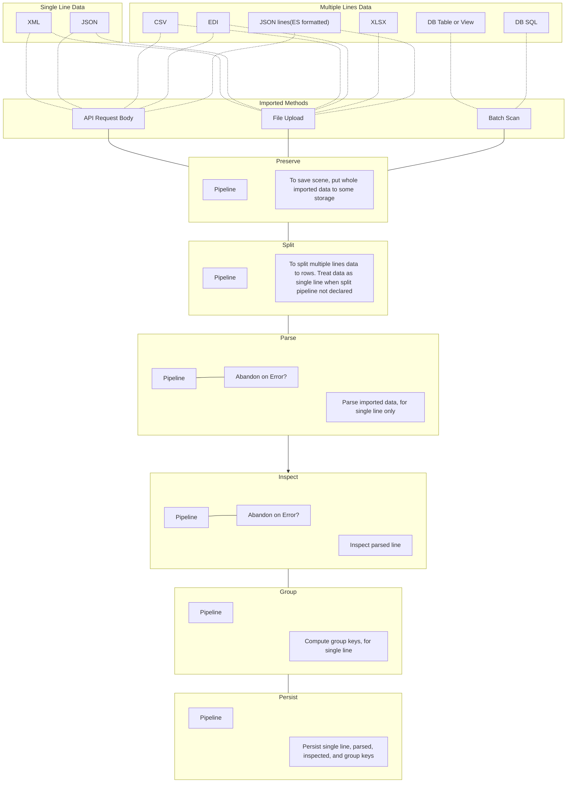

# Shared Model

For frontend and backend both.

# Import Row Data

```mermaid
flowchart TB
 subgraph subGraph0["Single Line Data"]
    direction TB
        XML["XML"]
        JSON["JSON"]
  end
  subgraph subGraph1["Multiple Lines Data"]
    direction TB
        CSV["CSV"]
        EDI["EDI"]
        XLSX["XLSX"]
        JSONL["JSON lines(ES formatted)"]
        TBL["DB Table or View"]
        SQL["DB SQL"]
  end
  subgraph subGraph2["Imported Methods"]
    direction TB
        API["API Request Body"]
        File["File Upload"]
        DB["Batch Scan"]
  end
  subgraph Preserve["Preserve"]
    direction LR
        PreservePipeline["Pipeline"]
        PreserveComment["To save scene, put whole imported data to some storage"]
  end
  subgraph Split["Split"]
    direction LR
        SplitPipeline["Pipeline"]
        SplitComment["To split multiple lines data to rows. Treat data as single line when split pipeline not declared"]
  end
  subgraph Parse["Parse"]
    direction LR
        ParsePipeline["Pipeline"]
        ParseComment["Parse imported data, for single line only"]
        ParseAbandonOnError["Abandon on Error?"]
  end
  subgraph Inspect["Inspect"]
    direction LR
        InspectPipeline["Pipeline"]
        InspectComment["Inspect parsed line"]
        InspectAbandonOnError["Abandon on Error?"]
  end
  subgraph Group["Group"]
    direction LR
        GroupPipeline["Pipeline"]
        GroupComment["Compute group keys, for single line"]
  end
  subgraph Persist["Persist"]
    direction LR
        PersistPipeline["Pipeline"]
        PersistComment["Persist single line, parsed, inspected, and group keys"]
  end

    PreservePipeline ~~~ PreserveComment
    SplitPipeline ~~~ SplitComment
    ParsePipeline ~~~ ParsePipeline
    ParsePipeline --- ParseAbandonOnError
    InspectPipeline ~~~ InspectPipeline
    InspectPipeline --- InspectAbandonOnError
    GroupPipeline ~~~ GroupPipeline
    PersistPipeline ~~~ PersistPipeline
    XML -...- API & File
    JSON -...- API & File
    CSV -...- API & File
    EDI -...- API & File
    XLSX -...- File
    JSONL -...- API & File
    TBL -...- DB
    SQL -...- DB
    API --- Preserve
    File --- Preserve
    DB --- Preserve
    Preserve --- Split
    Split --- Parse
    Parse ---> Inspect
    Inspect --- Group
    Group --- Persist
    
%%    PreservePipeline@{ shape: tag-rect}
%%    PreserveComment@{ shape: braces}
%%    SplitPipeline@{ shape: tag-rect}
%%    SplitComment@{ shape: braces}
%%    ParseComment@{ shape: braces}
%%    ParseAbandonOnError@{ shape: hex}
%%    InspectComment@{ shape: braces}
%%    InspectAbandonOnError@{ shape: hex}
%%    GroupComment@{ shape: braces}
%%    PersistComment@{ shape: braces}
```